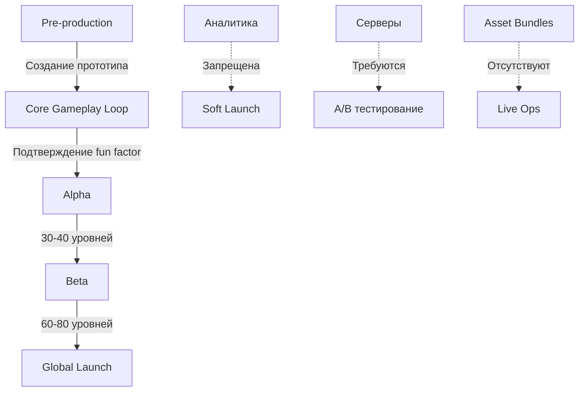

# Анализ противоречий и проблем плана разработки Match-3 AI

**Дата анализа:** 09.02.2026  
**Версия анализа:** 2.0 (независимый анализ)  
**Статус:** Черновик для обсуждения

---

## 1. Противоречия в количестве уровней

### 1.1. Несоответствие между этапами разработки

| Этап | Уровни (документ 09) | Уровни (документ 01) | Уровни (документ 05) |
|------|---------------------|---------------------|---------------------|
| Alpha | 30-40 | 30+ | 30+ |
| Beta | 60-80 | 70-80 | 60-80 |
| Global Launch | 80 | 80 | 80 |

**Проблема:** В [09_План_разработки.md:68](Docs/Plan/09_План_разработки.md:68) указано 60-80 уровней для Beta, а в [01_Концепция_и_видение.md:99](Docs/Plan/01_Концепция_и_видение.md:99) — 70-80 уровней. Отсутствует чёткое согласованное число.

**Рекомендация:** Установить единые значения:
- Alpha: фиксировано 35 уровней
- Beta: фиксировано 70 уровней
- Global Launch: фиксировано 80 уровней (追加 10 уровней на финальном этапе)

### 1.2. Прыжок количества уровней

**Проблема:** Переход с 30-40 (Alpha) на 60-80 (Beta) требует создания 20-50 новых уровней за один этап. Это создаёт риск:
- Нехватки времени на качественную балансировку
- Использования шаблонных уровней
- Увеличения нагрузки на тестирование

**Рекомендация:** Пересмотреть распределение:
- Alpha: 35 уровней
- Beta: 55-60 уровней
- Soft Launch: 70 уровней
- Global Launch: 80 уровней

---

## 2. Противоречия в технической архитектуре

### 2.1. Конфликт Live Ops и системы хранения уровней

| Аспект | [05_Прогрессия_и_сложность.md:59-61](Docs/Plan/05_Прогрессия_и_сложность.md:59) | [09_План_разработки.md:117-119](Docs/Plan/09_План_разработки.md:117) |
|--------|----------------------------------------|------------------------------------------|
| DLC | Не поддерживается | Не упоминается |
| Добавление уровней | Требует пересборки билда | "Новые уровни на регулярной основе" |
| Asset Bundles | Отсутствуют | Не упоминаются |

**Проблема:** Live Ops требует регулярного добавления контента без пересборки билда, но текущая архитектура (ScriptableObject без Asset Bundles) этого не поддерживает.

**Решение (Вариант A):** Отказ от Live Ops в классическом смысле
- Все 80 уровней доступны с момента релиза
- Обновления после Global Launch ограничены:
  - Bug fixes и стабилизация
  - Баланс-патчи (корректировка сложности уровней)
  - Оптимизация производительности
- Сезонные/праздничные события реализуются через:
  - Временные визуальные темы (скины интерфейса)
  - Специальные цели на существующих уровнях
  - Дополнительные звёзды/награды за прохождение
- Расширение контента возможно только через полноценные обновления с пересборкой билда

**Преимущества:**
- Соответствует архитектурным ограничениям (ScriptableObject)
- Не требует серверной инфраструктуры
- Фокус на качестве 80 уровней вместо количества
- Соответствует запрету на аналитику и сторонние плагины

### 2.2. Противоречие в аналитике

| Аспект | [09_План_разработки.md:150](Docs/Plan/09_План_разработки.md:150) | [01_Концепция_и_видение.md:100](Docs/Plan/01_Концепция_и_видение.md:100) |
|--------|----------------------------------------|------------------------------------------|
| Аналитика | [ЗАПРЕЩЕНО] | "Testing metrics, data collection" |
| A/B тестирование | [ТРЕБУЕТ СЕРВЕРОВ] | Не упоминается |

**Проблема:** Soft Launch предполагает сбор метрик и данных, но аналитика запрещена, а A/B тестирование требует серверов (которые не входят в проект).

**Рекомендация:** Уточнить цели Soft Launch:
- Если без аналитики → фокус на стабильности и багфиксинге
- Если нужна аналитика → требуется серверная инфраструктура (добавить в техтребования)

---

## 3. Противоречия в контент-плане

### 3.1. Несоответствие типов препятствий

| Этап | [09_План_разработки.md:53](Docs/Plan/09_План_разработки.md:53) | [05_Прогрессия_и_сложность.md:122-129](Docs/Plan/05_Прогрессия_и_сложность.md:122) |
|------|----------------------------------------|------------------------------------------|
| Alpha | "Все типы препятствий" | Ice, Box, Jelly (только 3 типа) |
| Beta | Не уточняет | Ice, Box, Jelly, Stone, Chain, Spawners (6 типов) |

**Проблема:** На этапе Alpha заявлены "все типы препятствий", но прогрессия сложности в документе 05 показывает только 3 типа для ранних уровней.

**Рекомендация:** Переформулировать в [09_План_разработки.md:53](Docs/Plan/09_План_разработки.md:53):
- **Текущее:** "Все типы препятствий"
- **Исправленное:** "Базовые типы препятствий (Ice, Box, Jelly) + архитектура для расширения"

### 3.2. Противоречие в типах уровней

| Аспект | [02_Основной_геймплей.md](Docs/Plan/02_Основной_геймплей.md) | [09_План_разработки.md:55](Docs/Plan/09_План_разработки.md:55) |
|--------|----------------------------------------|------------------------------------------|
| Типы уровней | Collection, Clear, Drop, Score (4 типа) | 4 типа уровней |
| Ingredient/Drop | В документе 02 упоминается "выход для ингредиентов" | "Drop" указан в списке |

**Проблема:** В [02_Основной_геймплей.md:61](Docs/Plan/02_Основной_геймплей.md:61) упоминается `CellType` с типом "выход для ингредиентов", но в основном списке типов уровней ([02_Основной_геймплей.md](Docs/Plan/02_Основной_геймплей.md) не указан тип "Collect Ingredients").

**Рекомендация:** Добавить в список типов уровней в [02_Основной_геймплей.md](Docs/Plan/02_Основной_геймплей.md):
- **Добавить:** "Collect Ingredients" (сбор ингредиентов)
- **Уточнить:** Является ли Drop синонимом Collect Ingredients или это разные механики

---

## 4. Противоречия в графике и Roadmap

### 4.1. Неправильные индикаторы прогресса

| Этап | [09_План_разработки.md:134-147](Docs/Plan/09_План_разработки.md:134) | [09_План_разработки.md:150-157](Docs/Plan/09_План_разработки.md:150) |
|------|----------------------------------------|------------------------------------------|
| Alpha | ✅ 30 уровней | ❌ Не оценено |
| Beta | ✅ 80 уровней | ✅ 80 уровней |
| Soft Launch | ❌ Аналитика [ЗАПРЕЩЕНО] | ✅ Корректировки баланса |

**Проблема:** Roadmap содержит emoji-индикаторы (✅/❌), но они:
- Не соответствуют друг другу между разделами
- Не объясняют критерии оценки
- Soft Launch имеет ❌ для аналитики, но цели включают тестирование метрик

### 4.2. Отсутствие метрик для Pre-production

**Проблема:** Нет чётких критериев перехода от Pre-production к Alpha. Какие метрики определяют "подтверждение fun factor"?

**Рекомендация:** Добавить конкретные критерии выхода из Pre-production:
- Win Rate на тестовых уровнях > 70%
- Время сессии > 5 минут
- Количество перезапусков уровня < 3
- Положительный фидбек от тестировщиков (субъективно)

---

## 5. Противоречия в системе сложности

### 5.1. Несоответствие параметров сложности

| Параметр | [05_Прогрессия_и_сложность.md:124](Docs/Plan/05_Прогрессия_и_сложность.md:124) | [05_Прогрессия_и_сложность.md:126](Docs/Plan/05_Прогрессия_и_сложность.md:126) |
|----------|----------------------------------------|------------------------------------------|
| Типы элементов 11-20 | 5 | 5 |
| Типы элементов 21-40 | 5-6 | 5-6 |

**Проблема:** Отсутствует прогрессия между уровнями 11-20 (5 типов) и 21-40 (5-6 типов). Переход должен быть более явным.

**Рекомендация:** Уточнить:
- 1-10: 4 типа
- 11-25: 5 типов
- 26-50: 6 типов
- 51+: 7 типов

### 5.2. Противоречие в Win Rate

| Сложность | [05_Прогрессия_и_сложность.md:165-168](Docs/Plan/05_Прогрессия_и_сложность.md:165) |
|-----------|----------------------------------------|
| Easy | 80-90% |
| Medium | 60-70% |
| Hard | 30-50% |
| Expert | 20-40% |

**Проблема:** Очень низкий Win Rate для Hard/Expert уровней. Игроки могут воспринимать это как "pay-to-win" или нечестную сложность.

**Рекомендация:** Пересмотреть целевые Win Rates:
- Easy: 85-95%
- Medium: 70-80%
- Hard: 50-65%
- Expert: 35-50%

---

## 6. Противоречия в требованиях к ресурсам

### 6.1. Противоречие размера билда

| Аспект | [10_Технические_требования.md:41](Docs/Plan/10_Технические_требования.md:41) | [10_Технические_требования.md:82](Docs/Plan/10_Технические_требования.md:82) |
|--------|----------------------------------------|------------------------------------------|
| Целевой размер билда | < 100 MB | "60 FPS на средних устройствах" |
| Графика | "Placeholder" на Pre-production | "Финальная графика" на Beta |

**Проблема:** Финальная графика + 80 уровней + полное аудио + анимации могут легко превысить 100 MB.

**Рекомендация:** Уточнить требования к размеру:
- Установить реалистичный лимит: 150-200 MB
- Или明确 указать, какие ассеты использовать (упрощённые)
- Добавить компрессию текстур в план оптимизации

### 6.2. Противоречие в оптимизации BFS

| Аспект | [03_Алгоритмы_и_системы.md:67](Docs/Plan/03_Алгоритмы_и_системы.md:67) | [10_Технические_требования.md:73-83](Docs/Plan/10_Технические_требования.md:73) |
|--------|----------------------------------------|------------------------------------------|
| Сложность BFS | O(V + E) | "Object Pooling для списков" |
| Каскады | Множественные вызовы | "Ранний выход при отсутствии матчей" |

**Проблема:** BFS алгоритм описан в документе 03, но оптимизации в документе 10 не согласованы с базовой реализацией.

**Рекомендация:** Связать разделы:
- Добавить в [03_Алгоритмы_и_системы.md](Docs/Plan/03_Алгоритмы_и_системы.md) секцию об оптимизации со ссылкой на [10_Технические_требования.md](Docs/Plan/10_Технические_требования.md)
- Указать, что Object Pooling — обязательная часть реализации BFS

---

## 7. Противоречия в документации

### 7.1. Ошибки в перекрёстных ссылках

| Ссылка | Целевой документ | Статус |
|--------|-----------------|--------|
| [10_Технические_требования.md:105](Docs/Plan/10_Технические_требования.md:105) | "См. раздел 2.2.3" | Неверный номер раздела |
| [10_Технические_требования.md:108](Docs/Plan/10_Технические_требования.md:108) | "См. раздел 2.3.1" | Неверный номер раздела |
| [10_Технические_требования.md:111](Docs/Plan/10_Технические_требования.md:111) | "См. разделы 3.2.1, 3.3.1" | Разделы существуют в документе 05 |

**Проблема:** Нумерация разделов в ссылках не соответствует реальной структуре документов.

**Рекомендация:** Исправить ссылки:
- [10_Технические_требования.md:105](Docs/Plan/10_Технические_требования.md:105) → "См. [02_Основной_геймплей.md:97-105](Docs/Plan/02_Основной_геймплей.md:97)"
- [10_Технические_требования.md:108](Docs/Plan/10_Технические_требования.md:108) → "См. [02_Основной_геймплей.md:127-136](Docs/Plan/02_Основной_геймплей.md:127)"
- [10_Технические_требования.md:111](Docs/Plan/10_Технические_требования.md:111) → "См. [05_Прогрессия_и_сложность.md:74-90](Docs/Plan/05_Прогрессия_и_сложность.md:74)"

### 7.2. Дублирование структуры

| Аспект | [10_Технические_требования.md:100-102](Docs/Plan/10_Технические_требования.md:100) |
|--------|----------------------------------------|
| "Приложения" | Написано дважды |

**Рекомендация:** Удалить дублирование строки 100-101.

---

## 8. Потенциальные риски реализации

### 8.1. Критические зависимости

**Риск:** Live Ops невозможен без Asset Bundles или пересборки билда.

### 8.2. Риск перегрузки этапа Beta

| Задача Beta | Оценка сложности |
|-------------|------------------|
| Финальная графика и анимации | Высокая |
| Полный аудио | Высокая |
| 60-80 уровней с кривой сложности | Очень высокая |
| Оптимизация 60 FPS | Высокая |
| Тестирование Win Rate | Средняя |

**Рекомендация:** Разделить Beta на две фазы:
- Beta 1: Content completion (все уровни)
- Beta 2: Polish & Optimization

---

## 9. Сводные рекомендации

### 9.1. Приоритетные исправления

| № | Проблема | Приоритет | Статус |
|---|----------|-----------|--------|
| 1 | ~~Противоречие Live Ops и ScriptableObject~~ | ~~Критический~~ | **РЕШЕНО** — выбран Вариант A |
| 2 | Несоответствие количества уровней | Высокий | Требует решения |
| 3 | Отсутствие критериев выхода из Pre-production | Высокий | Требует решения |
| 4 | Ошибки в перекрёстных ссылках | Средний | Требует решения |
| 5 | Противоречие Win Rate для Hard уровней | Средний | Требует решения |

### 9.2. Изменения в формулировках

#### До:
> "Alpha: 30-40 уровней"
> "Beta: 60-80 уровней"

#### После:
> "Alpha: 35 уровней (полный набор механик)"
> "Beta: 55 уровней (финальная полировка)"
> "Soft Launch: 70 уровней"
> "Global Launch: 80 уровней"

#### До:
> "Все типы препятствий" (Alpha)

#### После:
> "Базовые типы препятствий (Ice, Box, Jelly) с архитектурой для расширения"

---

## 10. Заключение

План разработки содержит **6 активных противоречий**, **4 потенциальных риска** и **множество мелких несоответствий**. **Одно критическое противоречие решено** (Live Ops vs ScriptableObject).

### Активные проблемы:

1. **Несоответствие метрик** (количество уровней, Win Rate)
2. **Отсутствие чётких критериев перехода** между этапами
3. **Ошибки в документации** (перекрёстные ссылки)

### Решённые проблемы:
- **Live Ops:** Выбран Вариант A — отказ от классического Live Ops, все 80 уровней с релиза

Рекомендуется провести **ревизию оставшихся документов** и установить **стандарт нумерации разделов** для всех документов.

---

**Документ подготовлен для обсуждения командой разработки**
