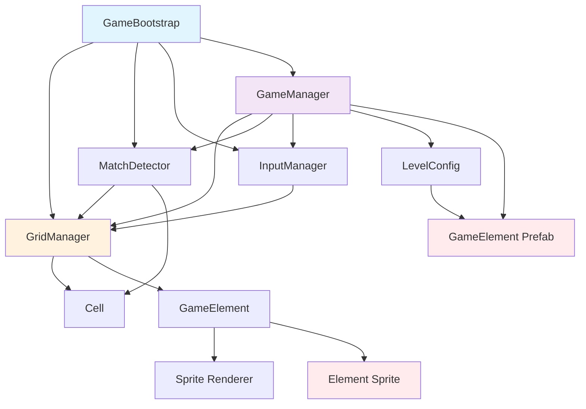

# Отчёт об ассетах проекта Match-3 AI

**Дата создания:** 2026-02-09  
**Версия Unity:** 2022.3.62f3  
**Тип проекта:** 2D Match-3 Puzzle Game  
**Платформа:** Android  

---

## 1. Резюме для руководства

Проект находится на ранней стадии pre-production прототипа. Полностью реализована **логика игры на C#** (9 скриптов), но **отсутствуют практически все визуальные и аудио ассеты**. Для запуска игры в редакторе Unity необходимо создать или импортировать следующие категории ассетов:

- **Критически важные:** Префабы игровых элементов, текстуры, материалы
- **Необходимые для функциональности:** UI элементы, аудио SFX, фоновые изображения
- **Опциональные улучшения:** Анимации, VFX эффекты, дополнительные UI экраны

---

## 2. Существующие ассеты

### 2.1. Скрипты C# (Полностью готовы)

| Файл | Путь | Размер | Описание |
|------|------|--------|----------|
| [`Enums.cs`](Assets/Scripts/Core/Enums.cs:1) | `Assets/Scripts/Core/` | ~1 KB | Перечисления: ElementType, GridShape, CellType |
| [`Cell.cs`](Assets/Scripts/Core/Cell.cs:1) | `Assets/Scripts/Core/` | ~2 KB | Класс ячейки игрового поля |
| [`GameElement.cs`](Assets/Scripts/Core/GameElement.cs:1) | `Assets/Scripts/Core/` | ~4 KB | MonoBehaviour игрового элемента с визуальной логикой |
| [`LevelConfig.cs`](Assets/Scripts/Core/LevelConfig.cs:1) | `Assets/Scripts/Core/` | ~2 KB | ScriptableObject конфигурации уровня |
| [`GridManager.cs`](Assets/Scripts/Core/GridManager.cs:1) | `Assets/Scripts/Core/` | ~12 KB | Управление сеткой, соседями, перемещением элементов |
| [`MatchDetector.cs`](Assets/Scripts/Core/MatchDetector.cs:1) | `Assets/Scripts/Core/` | ~10 KB | Алгоритм BFS поиска совпадений |
| [`InputManager.cs`](Assets/Scripts/Core/InputManager.cs:1) | `Assets/Scripts/Core/` | ~10 KB | Обработка свайпов и ввода игрока |
| [`GameManager.cs`](Assets/Scripts/Core/GameManager.cs:1) | `Assets/Scripts/Core/` | ~20 KB | Главный менеджер игры и GameStateMachine |
| [`GameBootstrap.cs`](Assets/Scripts/Core/GameBootstrap.cs:1) | `Assets/Scripts/Core/` | ~8 KB | Автоматическая настройка сцены |

**Всего:** 9 скриптов, ~69 KB исходного кода

### 2.2. Unity Сцена

| Файл | Путь | Статус |
|------|------|--------|
| [`MainScene.unity`](Assets/Scenes/MainScene.unity:1) | `Assets/Scenes/` | Базовая сцена с Main Camera |

**Содержимое сцены:**
- Main Camera (Orthographic, Size: 5, Background: #313749)
- AudioListener
- Пустая сцена (объекты создаются через GameBootstrap)

### 2.3. Конфигурация проекта

| Файл | Путь | Описание |
|------|------|----------|
| `ProjectVersion.txt` | `ProjectSettings/` | Unity 2022.3.62f3 |
| `ProjectSettings.asset` | `ProjectSettings/` | Основные настройки плеера |
| `AudioManager.asset` | `ProjectSettings/` | Настройки звука |
| `InputManager.asset` | `ProjectSettings/` | Настройки ввода |
| `QualitySettings.asset` | `ProjectSettings/` | Настройки качества |

---

## 3. Архитектура системы и зависимости



### Ключевые зависимости ассетов

1. **GameElement Prefab** → Требуется для: LevelConfig, GameManager, GameBootstrap
2. **Sprites (x7)** → Требуется для: GameElement Prefab
3. **Materials (x7)** → Требуется для: Sprite Renderers
4. **Audio SFX** → Требуется для: GameManager (Match, Swap, Destroy events)
5. **Background Sprite** → Требуется для: MainScene Camera

---

## 4. Отсутствующие ассеты по категориям

### 4.1. КРИТИЧЕСКИ ВАЖНЫЕ АССЕТЫ (Без которых игра не запустится)

#### 4.1.1. Префаб игрового элемента (GameElement Prefab)

| Параметр | Значение |
|----------|----------|
| **Расположение** | `Assets/Prefabs/ElementPrefab.prefab` |
| **Формат** | Unity Prefab (.prefab) |
| **Размер** | ~1-2 KB |
| **Зависимости** | SpriteRenderer, GameElement.cs script |

**Структура префаба:**
```
GameObject: ElementPrefab
├── SpriteRenderer (светится, если не назначен)
├── GameElement (MonoBehaviour)
└── CircleCollider2D (опционально для кликов)
```

**Связи в коде:**
- [`GameBootstrap.CreatePlaceholderElementPrefab()`](Assets/Scripts/Core/GameBootstrap.cs:99) - создаёт placeholder при отсутствии
- [`LevelConfig.elementPrefab`](Assets/Scripts/Core/LevelConfig.cs:22) - ссылка на префаб
- [`GameManager.CreateElement()`](Assets/Scripts/Core/GameManager.cs:197) - инстанцирование элементов

**Рекомендация по восстановлению:**
```csharp
// Временное решение: GameBootstrap создаёт программный спрайт
// Постоянное решение: Создать префаб с реальными спрайтами
```

#### 4.1.2. Спрайты игровых элементов

| Тип элемента | Цвет (RGB) | Файл | Статус |
|--------------|------------|------|--------|
| Red | #FF3B3B | `Assets/Sprites/Elements/red_gem.png` | ❌ ОТСУТСТВУЕТ |
| Orange | #FF8C3B | `Assets/Sprites/Elements/orange_gem.png` | ❌ ОТСУТСТВУЕТ |
| Yellow | #FFD93B | `Assets/Sprites/Elements/yellow_gem.png` | ❌ ОТСУТСТВУЕТ |
| Green | #3BFF6E | `Assets/Sprites/Elements/green_gem.png` | ❌ ОТСУТСТВУЕТ |
| Blue | #3B88FF | `Assets/Sprites/Elements/blue_gem.png` | ❌ ОТСУТСТВУЕТ |
| Purple | #B03BFF | `Assets/Sprites/Elements/purple_gem.png` | ❌ ОТСУТСТВУЕТ |
| ColorBomb | #FFFFFF | `Assets/Sprites/Elements/color_bomb.png` | ❌ ОТСУТСТВУЕТ |

**Технические требования:**
- **Размер:** 128×128 px (рекомендуется Unity)
- **Формат:** PNG с прозрачностью (32-bit)
- **Sprite Mode:** Single
- **Pixels Per Unit:** 128
- **Filter Mode:** Point (no filter) для чёткости

**Рекомендуемые источники:**
- [Kenney.nl - Puzzle Pack 2](https://kenney.nl/assets/puzzle-pack-2) - CC0 License
- [OpenGameArt.org - Match-3 Assets](https://opengameart.org/art-search-advanced?keys=match+3)
- [Freepik - Match-3 Elements](https://www.freepik.com/free-photos-vectors/match-3) - Free License

**Код для визуализации:**
```csharp
// [GameElement.GetColorForElementType](Assets/Scripts/Core/GameElement.cs:66)
// Сейчас использует программные цвета Unity
// При отсутствии спрайта используется Color.red, Color.blue и т.д.
```

#### 4.1.3. LevelConfig ScriptableObject

| Параметр | Значение |
|----------|----------|
| **Расположение** | `Assets/Configs/LevelConfigs/` |
| **Формат** | Unity ScriptableObject (.asset) |
| **Количество** | Минимум 1 (для MVP) |

**Структура LevelConfig:**
```yaml
width: 8                    # Ширина сетки (по умолчанию)
height: 8                   # Высота сетки (по умолчанию)
shape: Rectangle            # GridShape enum
moves: 30                    # Количество ходов
targetScore: 1000           # Целевой счёт для победы
elementPrefab: null         # Ссылка на префаб (ОБЯЗАТЕЛЬНО)
```

**Рекомендация по созданию:**
1. Создать ScriptableObject через меню: `Assets → Create → Match3AI → Level Config`
2. Назначить ElementPrefab
3. Сохранить как `LevelConfigs/Level_01.asset`

---

### 4.2. НЕОБХОДИМЫЕ ДЛЯ БАЗОВОЙ ФУНКЦИОНАЛЬНОСТИ

#### 4.2.1. Аудио эффекты (SFX)

| Звук | Путь | Длительность | Приоритет |
|------|------|-------------|-----------|
| Swap (свап) | `Assets/Audio/SFX/swap.wav` | 0.2-0.3s | Высокий |
| Match 3 | `Assets/Audio/SFX/match_3.wav` | 0.3-0.4s | Высокий |
| Match 4 | `Assets/Audio/SFX/match_4.wav` | 0.4-0.5s | Средний |
| Match 5+ | `Assets/Audio/SFX/match_5.wav` | 0.5-0.6s | Средний |
| Destroy | `Assets/Audio/SFX/destroy.wav` | 0.3-0.4s | Высокий |
| Invalid Move | `Assets/Audio/SFX/invalid.wav` | 0.2s | Средний |
| Level Complete | `Assets/Audio/SFX/victory.wav` | 2-3s | Низкий |
| Level Failed | `Assets/Audio/SFX/defeat.wav` | 2-3s | Низкий |

**Формат:** WAV (16-bit, 44.1kHz), моно

**Рекомендуемые источники:**
- [Kenney.nl - UI Audio](https://kenney.nl/assets/ui-audio) - CC0 License
- [FreeSFX.co.uk](https://www.freesfx.co.uk/) - Free
- [ZapSplat](https://www.zapsplat.com/) - Free with attribution

**Интеграция в код:**
```csharp
// GameManager использует события для звуков:
OnScoreChanged?.Invoke(score);    // → Звук match
OnLevelComplete?.Invoke();       // → Звук победы
OnLevelFailed?.Invoke();        // → Звук поражения
```

#### 4.2.2. Фон игрового поля

| Параметр | Значение |
|----------|----------|
| **Расположение** | `Assets/Sprites/UI/background.png` |
| **Размер** | 2048×1536 px (или 1920×1080) |
| **Формат** | PNG, 32-bit |
| **Прозрачность** | Нет (полный кадр) |

**Стиль:** Нейтральный, не отвлекающий от игровых элементов

**Цветовая палитра (из GDD):**
- Фон: светлые пастельные тона (#F5F5DC, #E6F3FF)
- Акценты: яркие цвета для кнопок

#### 4.2.3. UI Элементы

| Элемент | Путь | Размер | Описание |
|---------|------|--------|----------|
| Button Normal | `Assets/Sprites/UI/button_normal.png` | 200×80 | Обычная кнопка |
| Button Pressed | `Assets/Sprites/UI/button_pressed.png` | 200×80 | Нажатая кнопка |
| Panel Background | `Assets/Sprites/UI/panel_bg.png` | 500×400 | Панель меню |
| Score Background | `Assets/Sprites/UI/score_bg.png` | 300×100 | Фон очков |
| Moves Background | `Assets/Sprites/UI/moves_bg.png` | 300×100 | Фон ходов |
| Icon Star | `Assets/Sprites/UI/icon_star.png` | 64×64 | Иконка звезды |

**Примечание:** UI Canvas будет создан динамически или потребует отдельной сцены

#### 4.2.4. Material для спрайтов

| Material | Shader | Путь |
|----------|--------|------|
| ElementMaterial_Red | Sprites/Default | `Assets/Materials/Elements/red.mat` |
| ElementMaterial_Orange | Sprites/Default | `Assets/Materials/Elements/orange.mat` |
| ElementMaterial_Yellow | Sprites/Default | `Assets/Materials/Elements/yellow.mat` |
| ElementMaterial_Green | Sprites/Default | `Assets/Materials/Elements/green.mat` |
| ElementMaterial_Blue | Sprites/Default | `Assets/Materials/Elements/blue.mat` |
| ElementMaterial_Purple | Sprites/Default | `Assets/Materials/Elements/purple.mat` |
| ElementMaterial_ColorBomb | Sprites/Default | `Assets/Materials/Elements/color_bomb.mat` |

**Shader:** Unity 2D → Sprites/Default или Sprites/Diffuse

---

### 4.3. ОПЦИОНАЛЬНЫЕ УЛУЧШЕНИЯ

#### 4.3.1. Анимации

| Анимация | Файл | Длительность | Тип |
|----------|------|--------------|-----|
| Swap | `Assets/Animations/Swap.anim` | 0.3s | Motion Tween |
| Destroy | `Assets/Animations/Destroy.anim` | 0.4s | Particle Burst |
| Fall | `Assets/Animations/Fall.anim` | 0.5s | Smooth Fall |
| Spawn | `Assets/Animations/Spawn.anim` | 0.3s | Scale from 0 |
| Booster Activate | `Assets/Animations/BoosterActivate.anim` | 0.5s | Flash + Expand |
| Match 4 Special | `Assets/Animations/Match4.anim` | 0.6s | Striped Effect |
| Match 5 Special | `Assets/Animations/Match5.anim` | 0.6s | Wrapped Effect |
| Color Bomb | `Assets/Animations/ColorBomb.anim` | 0.8s | Rainbow Pulse |

**Animator Controller:** `Assets/Animators/ElementController.controller`

**Интеграция:**
```csharp
// GameManager использует WaitForSeconds для анимаций:
swapDuration = 0.3f;      // [GameManager:41]
destroyDuration = 0.4f;    // [GameManager:42]
fallDuration = 0.5f;       // [GameManager:43]
spawnDuration = 0.3f;      // [GameManager:44]
```

#### 4.3.2. VFX Эффекты (Particle Systems)

| Эффект | Путь | Описание |
|--------|------|----------|
| Match Burst | `Assets/VFX/MatchBurst.prefab` | Вспышка при match (3 элемента) |
| Match 4+ Burst | `Assets/VFX/Match4Burst.prefab` | Усиленная вспышка (4+ элемента) |
| Color Bomb Explosion | `Assets/VFX/ColorBomb.prefab` | Радужный взрыв |
| Trail | `Assets/VFX/Trail.prefab` | След при падении |

**Настройки Particle System:**
- Duration: 0.5-1.0s
- Start Lifetime: 0.3-0.5s
- Start Speed: 5-10
- Emission Rate: 50-100
- Shape: Circle

#### 4.3.3. Препятствия (для будущих уровней)

| Препятствие | Файл | Цвет | Статус |
|-------------|------|------|--------|
| Ice | `Assets/Sprites/Obstacles/ice.png` | #A0D8EF | ❌ Опционально |
| Stone | `Assets/Sprites/Obstacles/stone.png` | #808080 | ❌ Опционально |
| Box | `Assets/Sprites/Obstacles/box.png` | #8B4513 | ❌ Опционально |
| Jelly | `Assets/Sprites/Obstacles/jelly.png` | #FF69B4 | ❌ Опционально |
| Chain | `Assets/Sprites/Obstacles/chain.png` | #C0C0C0 | ❌ Опционально |

#### 4.3.4. Бустеры (для будущих уровней)

| Бустер | Файл | Свойства | Статус |
|--------|------|----------|--------|
| Striped | `Assets/Sprites/Boosters/striped.png` | Match 4 создаёт | ❌ Опционально |
| Wrapped | `Assets/Sprites/Boosters/wrapped.png` | Match 5 создаёт | ❌ Опционально |
| Color Bomb | `Assets/Sprites/Boosters/color_bomb.png` | Combo 2 бустеров | ❌ Опционально |

#### 4.3.5. Музыка (Background Music)

| Трек | Путь | Длительность | Статус |
|------|------|--------------|--------|
| Main Theme | `Assets/Audio/Music/main_theme.mp3` | 2-3 min loop | ❌ Опционально |
| Menu Theme | `Assets/Audio/Music/menu_theme.mp3` | 1-2 min loop | ❌ Опционально |
| Victory Theme | `Assets/Audio/Music/victory.mp3` | 5-10s | ❌ Опционально |

**Формат:** MP3, 320kbps, 44.1kHz, стерео

#### 4.3.6. Шейдеры

| Шейдер | Путь | Описание |
|--------|------|----------|
| Glow | `Assets/Shaders/Glow.shader` | Свечение для Color Bomb |
| Pulsing | `Assets/Shaders/Pulsing.shader` | Пульсация для активных элементов |
| Gradient | `Assets/Shaders/Gradient.shader` | Градиентные фоны |

---

## 5. Структура папок для ассетов

```
Assets/
├── Audio/
│   ├── Music/
│   │   ├── main_theme.mp3
│   │   └── menu_theme.mp3
│   └── SFX/
│       ├── swap.wav
│       ├── match_3.wav
│       ├── match_4.wav
│       ├── match_5.wav
│       ├── destroy.wav
│       ├── invalid.wav
│       ├── victory.wav
│       └── defeat.wav
├── Animations/
│   ├── Animators/
│   │   └── ElementController.controller
│   ├── Swap.anim
│   ├── Destroy.anim
│   ├── Fall.anim
│   └── Spawn.anim
├── VFX/
│   ├── MatchBurst.prefab
│   ├── Match4Burst.prefab
│   ├── ColorBomb.prefab
│   └── Trail.prefab
├── Prefabs/
│   ├── ElementPrefab.prefab
│   ├── Obstacles/
│   └── Boosters/
├── Materials/
│   └── Elements/
│       ├── red.mat
│       ├── orange.mat
│       ├── yellow.mat
│       ├── green.mat
│       ├── blue.mat
│       ├── purple.mat
│       └── color_bomb.mat
├── Sprites/
│   ├── Elements/
│   │   ├── red_gem.png
│   │   ├── orange_gem.png
│   │   ├── yellow_gem.png
│   │   ├── green_gem.png
│   │   ├── blue_gem.png
│   │   ├── purple_gem.png
│   │   └── color_bomb.png
│   ├── Obstacles/
│   ├── Boosters/
│   └── UI/
│       ├── background.png
│       ├── button_normal.png
│       ├── button_pressed.png
│       ├── panel_bg.png
│       ├── score_bg.png
│       ├── moves_bg.png
│       └── icon_star.png
├── Shaders/
│   ├── Glow.shader
│   ├── Pulsing.shader
│   └── Gradient.shader
├── Scripts/
│   └── Core/
├── Scenes/
│   └── MainScene.unity
└── Configs/
    └── LevelConfigs/
        ├── Level_01.asset
        ├── Level_02.asset
        └── ...
```

---

## 6. Чек-лист для запуска в редакторе

### Минимальный набор (для прототипа)

- [ ] 1. Создать префаб `Assets/Prefabs/ElementPrefab.prefab`
- [ ] 2. Импортировать 7 спрайтов элементов в `Assets/Sprites/Elements/`
- [ ] 3. Создать LevelConfig: `Assets/Configs/LevelConfigs/Level_01.asset`
- [ ] 4. Назначить ElementPrefab в LevelConfig
- [ ] 5. Создать 7 материалов в `Assets/Materials/Elements/`
- [ ] 6. Импортировать 2-3 базовых SFX (swap, match, destroy)
- [ ] 7. Импортировать фоновый спрайт в `Assets/Sprites/UI/`
- [ ] 8. Запустить сцену MainScene

### Полный набор (для Alpha)

- [ ] Все 7 аудио SFX
- [ ] Background Music (2 трека)
- [ ] 6 UI спрайтов
- [ ] 5+ LevelConfig файлов
- [ ] Анимации для всех действий
- [ ] VFX Particle Effects
- [ ] Obstacle Sprites (5 типов)
- [ ] Booster Sprites (3 типа)
- [ ] Custom Shaders (3 шейдера)

---

## 7. Рекомендации по приоритетам

### Фаза 1: MVP (Week 1-2)

1. **Создать Element Prefab с placeholder спрайтами** (использовать простые геометрические фигуры из Unity)
2. **Создать 7 простых спрайтов** в любом графическом редакторе
3. **Настроить LevelConfig**
4. **Проверить gameplay loop** в редакторе

### Фаза 2: Pre-Alpha (Week 3-4)

1. **Заменить placeholder спрайты** на качественные assets
2. **Добавить базовые SFX** (3-5 звуков)
3. **Создать UI Canvas** с отображением Score и Moves
4. **Оптимизировать производительность**

### Фаза 3: Alpha (Week 5-8)

1. **Полный набор анимаций**
2. **VFX эффекты**
3. **10+ LevelConfigs**
4. **Background Music**
5. **Polishing и balancing**

---

## 8. Риски и потенциальные проблемы

| Риск | Вероятность | Влияние | Решение |
|------|-------------|---------|---------|
| Отсутствие спрайтов | Высокая | Критическое | Использовать placeholder из GameBootstrap |
| Неправильный формат аудио | Среднее | Среднее | Использовать WAV 16-bit 44.1kHz |
| Несовместимость префаба | Среднее | Критическое | Следовать структуре из раздела 4.1.1 |
| Large file sizes | Низкое | Низкое | Оптимизировать PNG compression |
| Missing dependencies | Среднее | Среднее | Проверять связи в коде перед импортом |

---

## 9. Источники бесплатных ассетов

### Графика
- [Kenney.nl - Puzzle Pack 2](https://kenney.nl/assets/puzzle-pack-2) - CC0
- [Kenney.nl - UI Audio](https://kenney.nl/assets/ui-audio) - CC0
- [OpenGameArt.org](https://opengameart.org/) - CC and GPL
- [Freepik](https://www.freepik.com/) - Free with attribution
- [itch.io - Free Assets](https://itch.io/game-assets/free/tag-match3) - Various

### Аудио
- [FreeSFX.co.uk](https://www.freesfx.co.uk/) - Free
- [ZapSplat](https://www.zapsplat.com/) - Free with attribution
- [SoundBible](http://soundbible.com/) - CC and Public Domain
- [Freesound.org](https://freesound.org/) - CC License

### Инструменты
- [Aseprite](https://www.aseprite.org/) - Pixel art editor
- [Bfxr](https://Bfxr.info) - 8-bit SFX generator
- [Bosca Ceoil](https://boscaceoil.net/) - Music creator

---

**Конец отчёта**

---
*Документ автоматически сгенерирован на основе анализа исходного кода и документации проекта Match-3 AI.*
